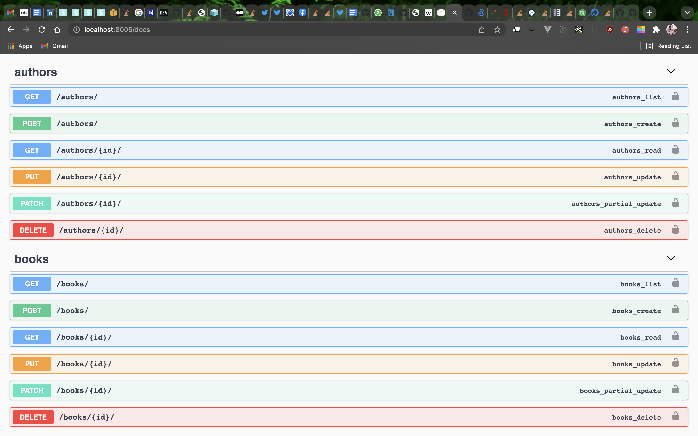

## API SCREEN

## Getting started
These instructions will get you a copy of the project up and running in your local machine for development and testing purposes.

## Prerequisites
- [Git](https://git-scm.com/download/)
- [Python 3.6 and above](https://www.python.org/downloads/)
- [PostgreSQL](https://www.postgresql.org/)
- [Docker](https://www.docker.com/)


## Installing
### Setting up the database
- Start your database server and create your database

### Setting up and Activating a Virtual Environment
- Create a working space in your local machine
- Clone this [repository](https://github.com/nicksonlangat/jambopay-bookstore-api.git) `git clone https://github.com/nicksonlangat/jambopay-bookstore-api.git`
- Navigate to the project directory
- Create a virtual environment `python3 -m venv name_of_your_virtual_environment` and activate it `source name_of_your_virtual_environment/bin/activate`
- Create a .env file in root directory and put these key=values in it:
```
DEBUG=on
SECRET_KEY='your secret key'
DB_NAME="your_db_name"
DB_USER="your_postgres_username"
DB_PASSWORD="your_postgres_password"
DB_PORT="your_postgres_port"
DB_HOST="localhost or any other host name"
```
- Install dependencies to your virtual environment `pip install -r requirements.txt`
- Migrate changes to the newly created database `python manage.py migrate`

## Starting the server
- Ensure you are in the project directory on the same level with `manage.py` and the virtual environment is activated
- Run the server `python manage.py runserver`

## PROJECT MODULES
- The project configs and settings is in the folder `inventory_project`
- Main app is `core`.
- Find the API documentation via `localhost:8000/docs` for API request endpoints.

## CONTAINERISATION
- Used Docker 
- You can build the spin up the docker containers by `docker-compose -f docker-compose.yml up --build `
- Visit `localhost` to view the app running inside the container.

## Running tests
- Tests can be run by using  `coverage run --source='.' manage.py test  `
- Check coverage report by `coverage report`